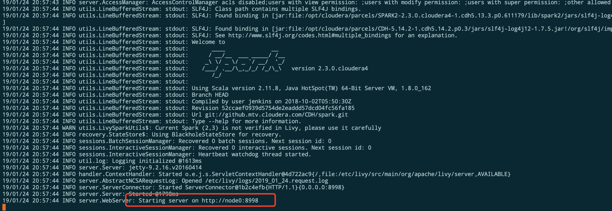

# 集群配置Livy

## 一、下载

Livy 官网地址：`http://livy.incubator.apache.org/download/`

具体指令：

```shell
# 进入指定目录
cd /home/admin/soft
# 下载文件
wget http://mirror.bit.edu.cn/apache/incubator/livy/0.5.0-incubating/livy-0.5.0-incubating-bin.zip
```


## 二、解压

```bash
unzip livy-0.5.0-incubating-bin.zip

# 重命名
mv livy-0.5.0-incubating-bin livy-0.5.0

# 复制到 /etc 目录下
cp -r livy-0.5.0 /etc/livy
```


## 三、更改配置文件

```shell
cd /etc
# 给文件夹赋予权限
chmod +777 livy
# 配置文件
cd /etc/livy/conf
cp livy-env.sh.template livy-env.sh
vim livy-env.sh
```

```properties
# - HADOOP_CONF_DIR Directory containing the Hadoop / YARN configuration to use.
HADOOP_CONF_DIR=/etc/hadoop/conf
# - SPARK_HOME      Spark which you would like to use in Livy.
SPARK_HOME=/opt/cloudera/parcels/SPARK2-2.3.0.cloudera4-1.cdh5.13.3.p0.611179/lib/spark2
```


## 四、启动服务

```shell
cd /etc/livy
# 新建日志目录，并给权限
mkdir logs
chmod +777 logs
./bin/livy-server
```

启动成功：



```shell
#后台模式
./bin/livy-server start
```

